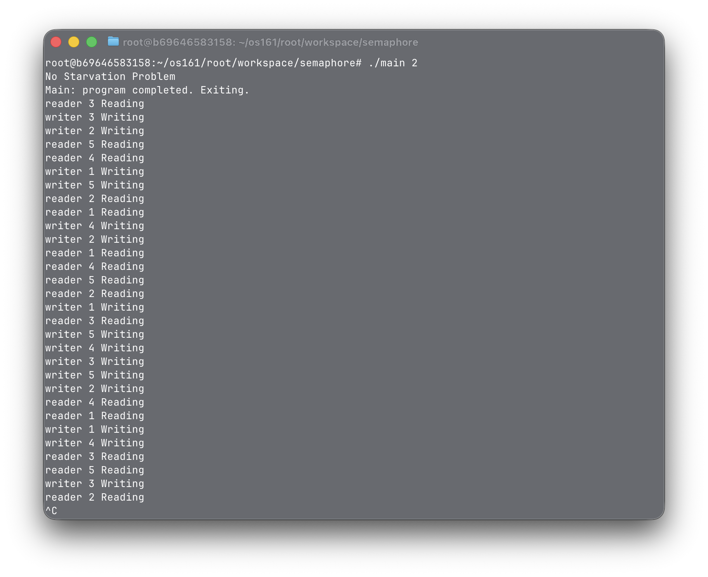
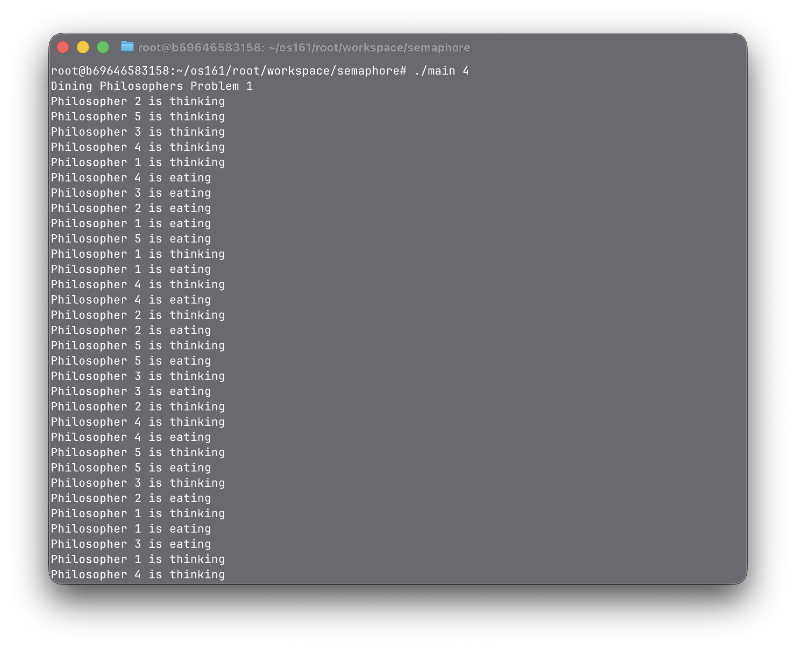

# CSE4001 – Synchronization Assignment

## Overview

This project implements several classic synchronization problems using POSIX threads and semaphores in C++.

All solutions follow the designs presented in:

**Allen B. Downey – _The Little Book of Semaphores_**  
http://greenteapress.com/wp/semaphores/

---

## Implemented Problems

| Problem # | Description |
|:---:|:---|
| 1 | Producer–Consumer |
| 2 | No-Starvation Readers–Writers |
| 3 | Writer-Priority Readers–Writers |
| 4 | Dining Philosophers – Solution #1 |
| 5 | Dining Philosophers – Solution #2 |

---

## Compilation

Compile using the Makefile:

```bash
make
```

Screenshot:  


This solution ensures that both readers and writers will eventually access the shared resource without one starving the other. It uses a turnstile semaphore combined with a LightSwitch pattern to guarantee fairness. Readers can run concurrently, while writers have exclusive access.

Screenshot:  


In this variation, writers take precedence over readers when waiting. Readers must wait if a writer is queued, preventing writer starvation entirely. The LightSwitch pattern is used again to efficiently coordinate multiple readers.

Screenshot:  


This implementation uses a semaphore-based footman to prevent deadlock by allowing only four philosophers to attempt to pick up forks simultaneously. Each philosopher alternates between thinking and eating. Fork acquisition is synchronized to avoid circular wait conditions.

Screenshot:  


This version is designed with an alternative locking strategy that eliminates deadlock while still maintaining concurrency. Philosophers think, eat, and release forks in repetition. This approach demonstrates how different semaphore solutions can produce correct behavior.

